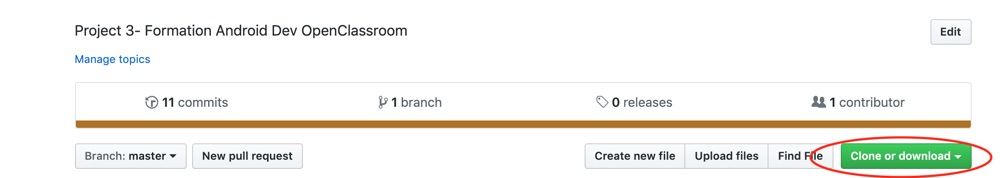
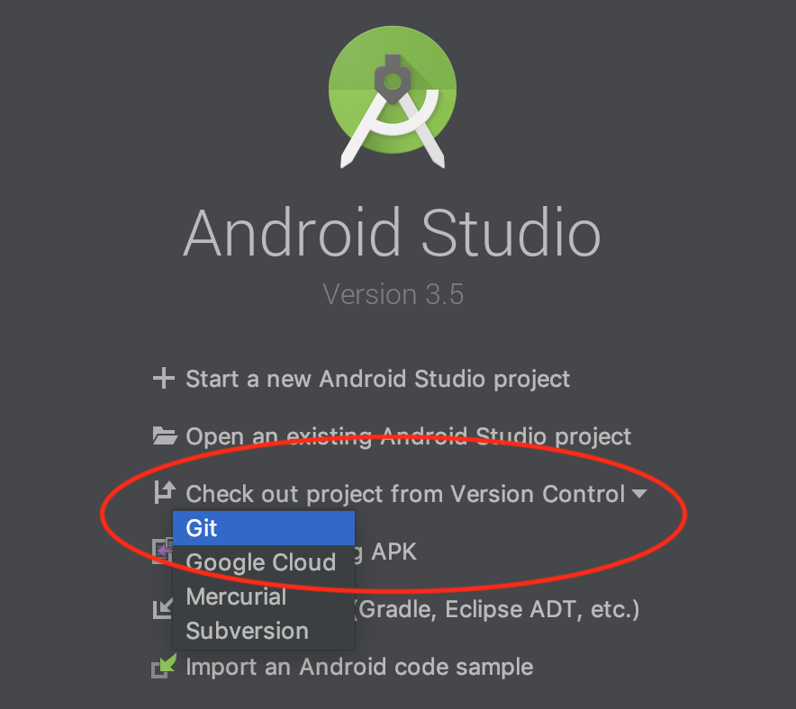
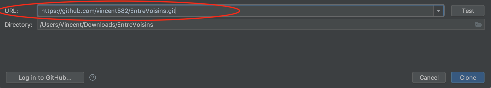
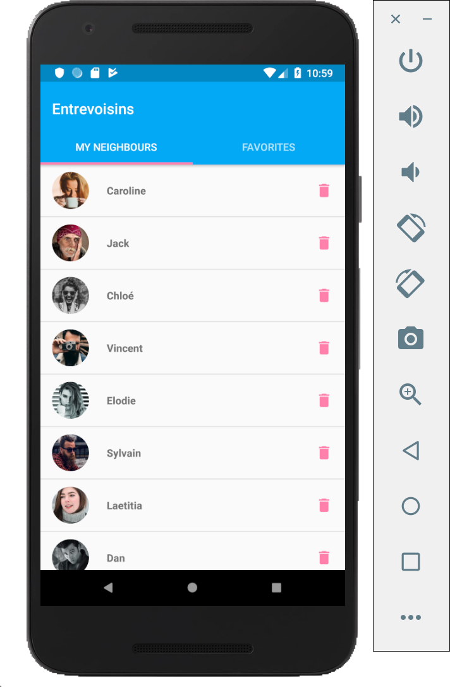

# EntreVoisins

**1 -** Télécharger où cloner le projet depuis l'adresse Github **https://github.com/vincent582/EntreVoisins/.** En cliquant sur ce boutton :

**2 -** Si besoin Télécharger Android Studio à l'adresse **https://developer.android.com/studio/?gclid=CjwKCAjwzdLrBRBiEiwAEHrAYlRMK-F1MuL4YASq_n9WskOl4XbUKdjzOv3SHLzIaZGrU4y5lzN5uhoCe38QAvD_BwE.**

**3 -** Au lancement d'Android Studio. Cliquez sur "Check out project from version control" et selectionnez Git :

**4 -** Collez l'Url précédemment cloné et cliquer sur clone.

**5 -** Attendre la fin de la compilation du projet Android. Ceci peut prendre quelque minutes.

**6 -** Sélectionnez un Emulateur puis éxécutez le projet à l'aide du boutton run d'android studio dans la bare d'outils.

**7 -** Enjoy!!

